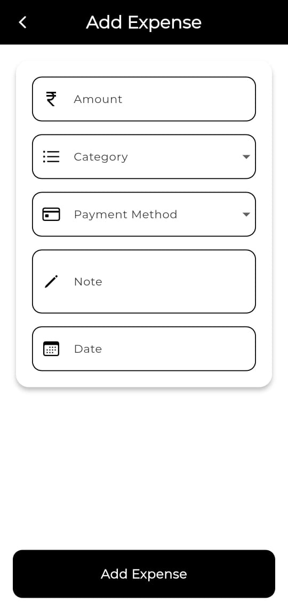
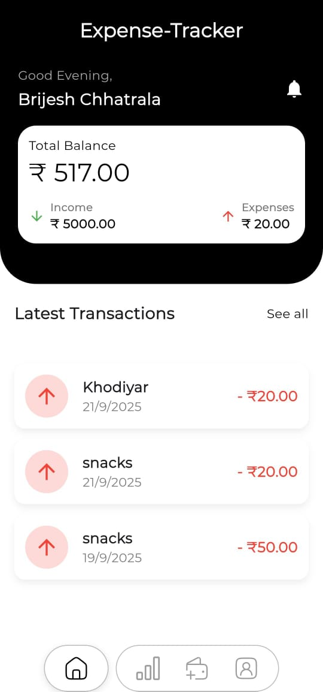
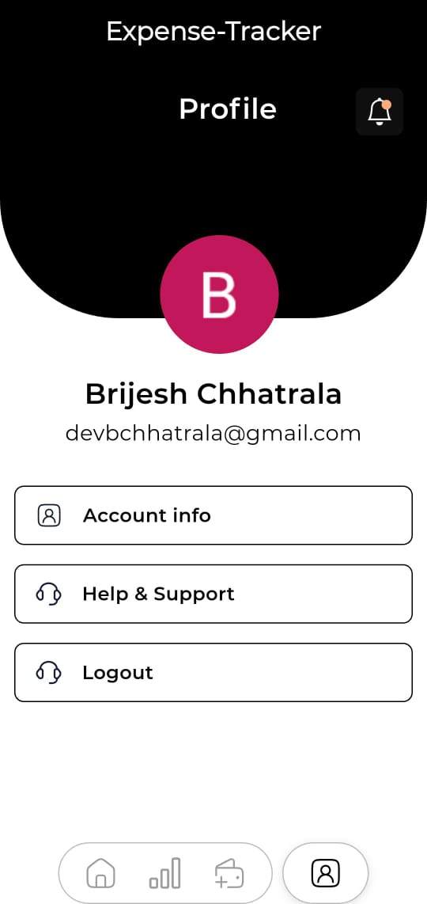

# 💰 Expense Tracker App

A modern **Flutter Expense Tracker** app to manage your incomes, expenses, and upcoming bills.  
Built with **Firebase** for authentication & data storage, **GetX** for state management, and **Syncfusion Charts** for analytics.  

---

## ✨ Features

- 🔑 **Authentication**
  - Login with **Email/Password**
  - Login with **Google Account**

- 📊 **Expense & Income Tracking**
  - Add, edit, and delete **income & expense records**
  - Organize data with **categories & timestamps**
  - Data stored securely in **Firebase Firestore**

- 📈 **Analytics Dashboard**
  - Interactive **Syncfusion Charts**
  - View reports **Daily, Weekly, Monthly, and Yearly**
  - Insights for better financial planning

- 🖼 **UI/UX**
  - **Clean & modern design**
  - Intuitive navigation
  - Responsive across devices

- ⚡ **State Management**
  - Powered by **GetX** for smooth performance

---

## 🛠 Tech Stack

- **Framework**: Flutter  
- **State Management**: GetX  
- **Backend/Database**: Firebase (Firestore, Auth)  
- **Charts & Analytics**: Syncfusion Flutter Charts  
- **Auth Methods**: Email/Password, Google Sign-In  

---

    
